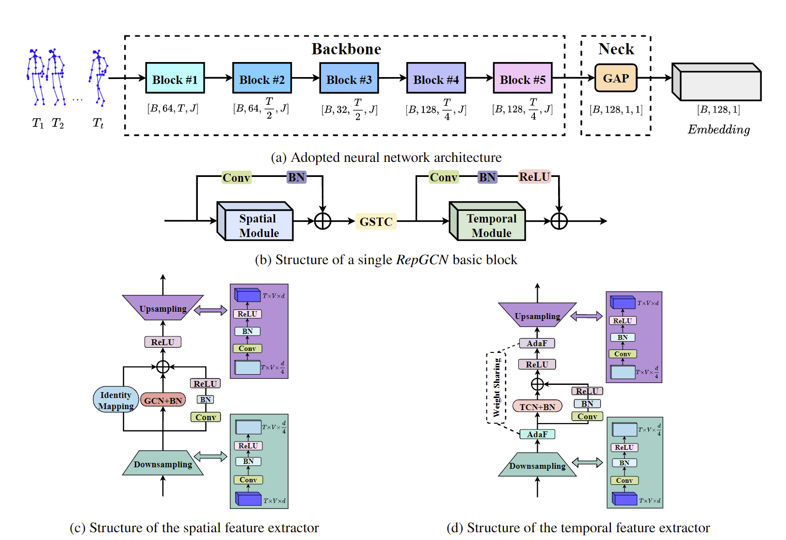
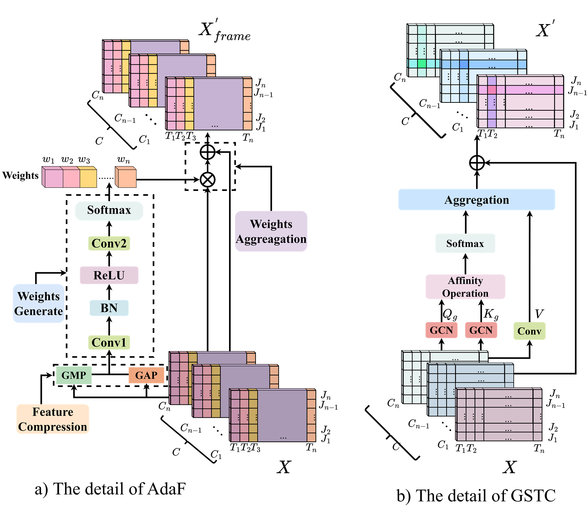

# RepGCN
**An Optimized Lightweight Graph Convolutional Network for Skeleton-Based Gait Recognition Considering Walking with an Accompanying Activity.** 

### Next， we will update more detail about our work!
